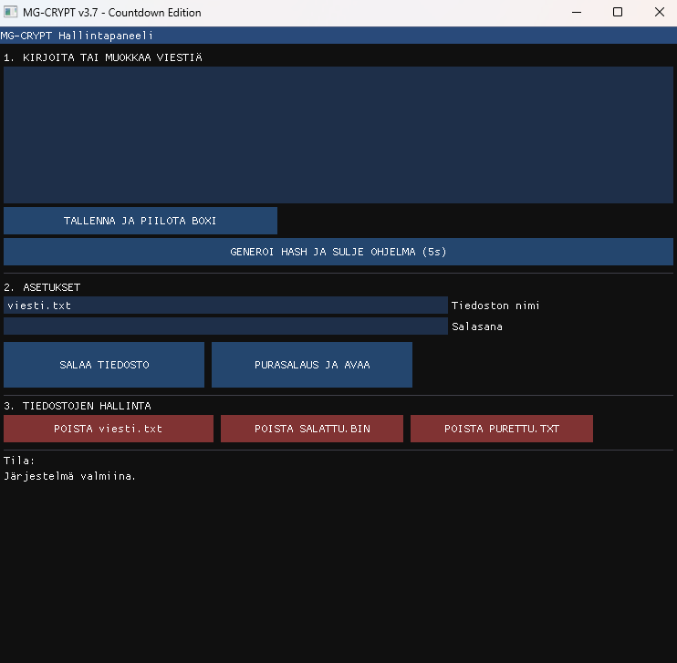

# MG---Crypt---Vault
Lightweight file encryption suite with XOR-logic, SHA-hashing, and auto-destruct countdown. Built with C++, OpenGL, and ImGui.
Kevyt ja interaktiivinen salausohjelma C++:lla.

Tämä projekti on luotu osoittamaan C++-ohjelmointia, Dear ImGui -käyttöliittymäsuunnittelua ja bittitason tiedostonkäsittelyä.

🚀 Ominaisuudet
*Interaktiivinen GUI: Stealth-käyttöliittymä, joka mukautuu tilanteen mukaan.

*Salaisuus: XOR-pohjainen tiedostojen salaus ja purku.

*Peruuttamaton Hash: Viestin muuttaminen hash-muotoon yhdellä klikkauksella.

*Itsetuho: Automaattinen sulkeutumislaskuri tietoturvan lisäämiseksi.

Voit kääntää ohjelman Windowsilla (MinGW) seuraavalla komennolla:

`g++ *.cpp -o mg_crypt.exe -I./include -L./lib -lglfw3dll -lopengl32 -lgdi32 -mwindows`
